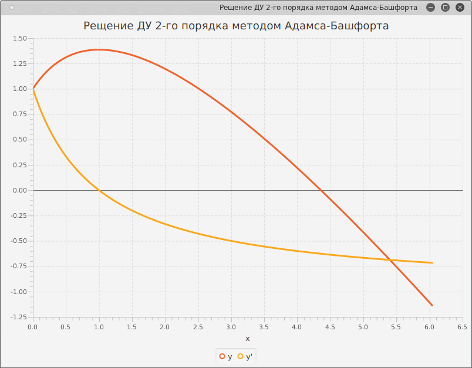

# numericalSolutions
some numerical solution to ODEs. Runge-Kutta | Adams-Bashfort.

Вычислительные формулы трёх простейших 
=======================================

Напишите в координатах вычислительные формулы трёх простейших численных
методов для решения следующей задачи

Метод Рунге-Кутты = простая формула Симпсона дано y' = f(x)
===========================================================

Дано дифференциальное уравнение y' = f(x). Показать | что метод
Рунге-Кутты 4-го порядка при решении этого уравнения превращается в
простую формулу Симпсона.

Является ли метод Рунге-Кутты устойчивым для следующей задачи?
==============================================================

Численного решения задачи Коши метод Рунге-Кутта
================================================

Написать и отладить программу численного решения задачи Коши,
предлагаемых ниже вариантов | используя указанный преподавателем метод:

\- Адамса -- Башфорта c ручным побором шага | обеспечивающего точность
0.0001 по у и y';

Вывод результатов осуществлять с заданным шагом hпечат в виде таблицы.

Постройте график решения по данным таблицы. Начальные точки получите
методом Рунге-Кутты 4-го порядка.

Вариант 6.

Резултаты
=========

Таблица 2

x | y | y'     
|---|:---:|---:|             
0.0| 1.0| 0.0
0.1| 1.0050125207872636| 0.10050125207614666
0.19999999999999998| 1.0202013062555868| 0.20404004927118735
0.3| 1.0460277460681844| 0.3138078769880498
0.4000000000000001| 1.0832868182191935| 0.43331400539821446
0.5000000000000001| 1.133147997244336| 0.5665729402232202
0.6000000000000002| 1.1972166072389616| 0.7183284808321776
0.7000000000000003| 1.2776201300875925| 0.8943320579804883
0.8000000000000004| 1.3771259786249137| 1.1016980274111368
0.9000000000000005| 1.4992998673681805| 1.349366163635125
1.0000000000000004| 1.6487174477767095| 1.6487124384319707
1.1| 1.8312467104960055| 2.0143646208948636
1.1999999999999997| 2.0544253469233746| 2.4653012651646717

y = 1.21448

x | y | y'     
|---|:---:|---:| 
0.6234049999999995| 1.214480285402369| 0.7571115774125108

Графический результаты
