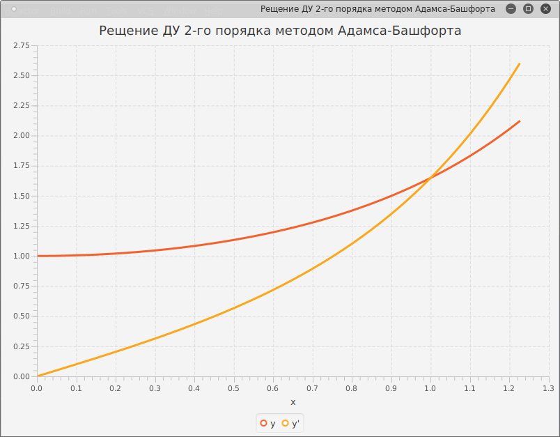

# numericalSolutions
some numerical solution to ODEs. Runge-Kutta, Adams-Bashfort.

Содержание 
===========

[Вычислительные формулы трёх простейших
2](#вычислительные-формулы-трёх-простейших)

[Явный метод Эйлера 2](#явный-метод-эйлера)

[Неявный метод Эйлера 3](#неявный-метод-эйлера)

[Модифицированный метод Эйлера 3](#модифицированный-метод-эйлера)

[Метод Рунге-Кутты = простая формула Симпсона дано y' = f(x)
4](#метод-рунге-кутты-простая-формула-симпсона-дано-y-fx)

[Является ли метод Рунге-Кутты устойчивым для следующей задачи?
4](#является-ли-метод-рунге-кутты-устойчивым-для-следующей-задачи)

[Численного решения задачи Коши метод Рунге-Кутта
5](#численного-решения-задачи-коши-метод-рунге-кутта)

[Резултаты 8](#резултаты)

Вычислительные формулы трёх простейших 
=======================================

Напишите в координатах вычислительные формулы трёх простейших численных
методов для решения следующей задачи

$$\left\{ \begin{matrix}
y^{''} = \frac{1}{\operatorname{}x} \\
y\left( \frac{\pi}{4} \right) = \frac{\ln 2}{2},\ \text{xϵ}\left\lbrack \frac{\pi}{4},\frac{9}{20}\pi \right\rbrack;h = \frac{\pi}{30} \\
y'\left( \frac{\pi}{4} \right) = 1\  \\
\end{matrix} \right.\ $$

Составим задачу Коши

$$\left\{ \begin{matrix}
\begin{matrix}
y^{'} = z \\
z^{'} = \ \frac{1}{\operatorname{}x} \\
y\left( \frac{\pi}{4} \right) = \frac{\ln 2}{2},\ \text{xϵ}\left\lbrack \frac{\pi}{4},\frac{9}{20}\pi \right\rbrack;h = \frac{\pi}{30} \\
z\left( \frac{\pi}{4} \right) = \ 1\  \\
\end{matrix} \\
\end{matrix} \right.\ $$

обозначим что

$$f\left( x,y,z \right) = z$$

$$g\left( x,y,z \right) = \frac{1}{\operatorname{}{x\ }}$$

Явный метод Эйлера
------------------

$$y_{i + 1} = \ y_{i} + hy_{i}^{2} + h$$

$$y_{i + 1} = y_{i} + \frac{\pi}{30}y_{i}^{2} + \frac{\pi}{30}$$

$${y'}_{i + 1} = {y'}_{i} + \frac{\pi}{30}{y'}_{i}^{2} + \frac{\pi}{30}$$

Неявный метод Эйлера
--------------------

$$y_{i + 1} = \ y_{i} + \frac{h}{2}f\left( x_{i},y_{i},z_{i} \right) + \frac{h}{2}f\left( x_{i + 1},y_{i + 1},z_{i + 1} \right)$$

$y_{i + 1} = y_{i} + \frac{h}{2}z_{i} + \frac{h}{2}z_{i + 1}$ (НМЭ 1)

$z_{i + 1} = z_{i} + \frac{h}{2}.\frac{1}{\operatorname{}x_{i}} + \frac{h}{2}.\frac{1}{\operatorname{}x_{i + 1}}$
(НМЭ 2)

Замена $z_{i + 1}$ в (НМЭ 1)

$y_{i + 1} = y_{i} + \frac{h}{2}z_{i} + \frac{h}{2}\left( z_{i} + \frac{h}{2}.\frac{1}{\operatorname{}x_{i}} + \frac{h}{2}.\frac{1}{\operatorname{}x_{i + 1}} \right)$
(НМЭ 3)

Так

$y_{i + 1} = y_{i} + \frac{h}{2}\left( 2z_{i\ } + \frac{h}{2}\left( \frac{1}{\operatorname{}x_{i}} + \frac{1}{\operatorname{}x_{i + 1}} \right) \right)$
(НМЭ 4)

$z_{i + 1} = z_{i} + \frac{h}{2}\left( \frac{1}{\operatorname{}x_{i}} + \frac{1}{\operatorname{}x_{i + 1}} \right)$
(НМЭ 5)

Модифицированный метод Эйлера
-----------------------------

$y_{i + 1} = \ y_{i} + \frac{h}{2}f\left( x_{i},y_{i},z_{i} \right) + \frac{h}{2}f\left( x_{i + 1},{y^{prog}}_{i + 1},{z^{prog}}_{i + 1} \right)$
(ММЭ 1)

Где $y^{prog} = y_{i} + hf\left( x_{i},y_{i},z_{i} \right)\ $

$y_{i + 1} = y_{i} + \frac{h}{2}\left( 2z_{i\ } + \frac{h}{2}\left( \frac{1}{\operatorname{}x_{i}} + \frac{1}{\operatorname{}x_{i + 1}} \right) \right)$
(ММЭ 2)

$z_{i + 1} = z_{i} + \frac{h}{2}\left( \frac{1}{\operatorname{}x_{i}} + \frac{1}{\operatorname{}x_{i + 1}} \right)$
(ММЭ 3)

Метод Рунге-Кутты = простая формула Симпсона дано y' = f(x)
===========================================================

Дано дифференциальное уравнение y' = f(x). Показать, что метод
Рунге-Кутты 4-го порядка при решении этого уравнения превращается в
простую формулу Симпсона.

$$y_{i + 1} = \ y_{i} + \frac{h}{6}\left( k_{1} + 2k_{2} + 2k_{3} + k_{4} \right)$$

Пусть $\frac{h}{2} = h^{'};\ h = 2h^{'}$

$$y_{i + 1} = \ y_{i} + \frac{2h'}{6}\left( k_{1} + 2k_{2} + 2k_{3} + k_{4} \right)$$

$$y_{i + 1} = \ y_{i} + \frac{h'}{3}\left( k_{1} + 2k_{2} + 2k_{3} + k_{4} \right)$$

А $x_{i} + h^{'} = \ x_{i + 1}$

*И* $x_{i} + 2h^{'} = \ x_{i + 2}$

*Дано y' = f(x)*

$$k_{1} = f\left( x_{i},y_{i} \right) = y_{i}$$

$$k_{2} = f\left( x_{i} + h^{'},y_{i} + h'k_{1} \right) = y_{i + 1}$$

$$k_{3} = f\left( x_{i} + h^{'},y_{i} + h'k_{2} \right) = y_{i + 1}$$

$$k_{4} = f\left( x_{i} + {2h}^{'},y_{i} + 2h'k_{3} \right) = y_{i + 2}$$

Замена k~i~ в уравнения получим

$y_{i + 1} = \ y_{i} + \frac{h'}{3}\left( y_{i} + 4y_{i + 1} + y_{i + 2} \right)$
*-- Формула Симпсона*

Является ли метод Рунге-Кутты устойчивым для следующей задачи?
==============================================================

$$\left\{ \begin{matrix}
y^{'} = y^{2} + 1 \\
y\left( 0 \right) = 0 \\
\end{matrix} \right.\ $$

$$f\left( x,y \right) = y^{2} + 1$$

$$f_{y}'\left( x,y \right) = {2y}^{2}$$

Для этой задачи, метод Рунге-Кутта неустойчиво так как условие

$\exists L > 0:\ \forall x\ \epsilon\left\lbrack x_{0},x_{n} \right\rbrack,\ \text{yϵ}\left( - \infty; + \infty \right):\left| f_{y}^{'}\left( x,y \right) \right| \leq L\ $не
выполняется при $y \approx \pm \infty$

Численного решения задачи Коши метод Рунге-Кутта
================================================

Написать и отладить программу численного решения задачи Коши,
предлагаемых ниже вариантов, используя указанный преподавателем метод:

\- Адамса -- Башфорта c ручным побором шага, обеспечивающего точность
0.0001 по у и y';

Вывод результатов осуществлять с заданным шагом hпечат в виде таблицы.

Таблица 1

  --- ------ -------
  t   y(t)   y'(t)
  --- ------ -------

Постройте график решения по данным таблицы. Начальные точки получите
методом Рунге-Кутты 4-го порядка.

Вариант 5.

$$\left\{ \begin{matrix}
\frac{{y^{'}}^{2} + 1}{1 + t^{2}} + y'' = 0 \\
y\left( 0 \right) = y'(0) = 1 \\
\end{matrix} \right.\ $$

$$\text{tϵ}\left\lbrack 0;6 \right\rbrack\ h_{0} = 0.15$$

численного решения задачи Коши

$$\left\{ \begin{matrix}
y^{'} = z \\
z' = \ \frac{\ z^{2} + 1}{\begin{matrix}
1 + t^{2} \\
\end{matrix}} \\
y\left( 0 \right) = z(0) = 1 \\
\end{matrix} \right.\ $$

Резултаты
=========

Таблица 2

  0.0                 1.0                   1.0
  
  
  0.0375              1.036127935895662     0.927710835861187
  
  
  5.999999999999988   -1.1080468790581544   -0.7142558585412455

ymax = 1.3862627454927932

Графический результаты
